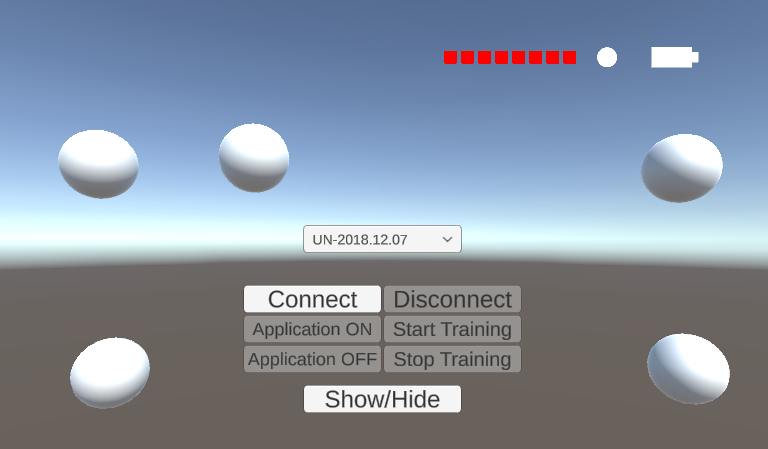
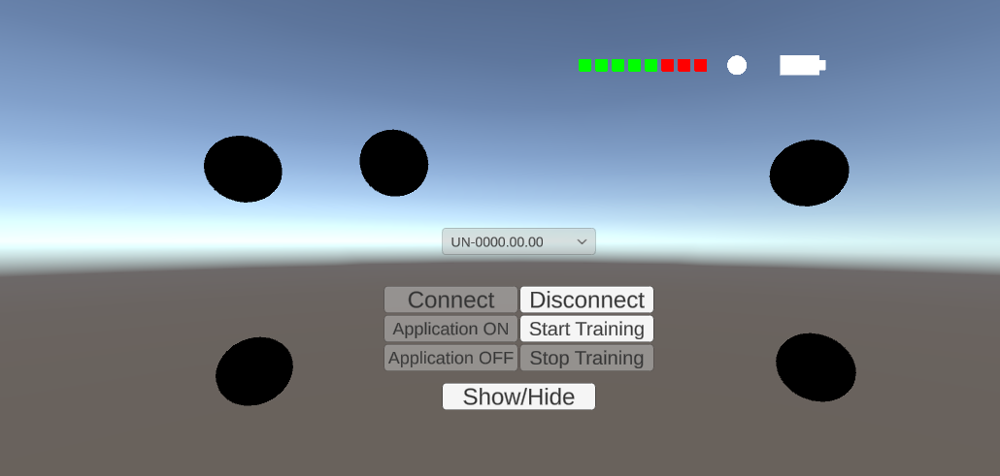
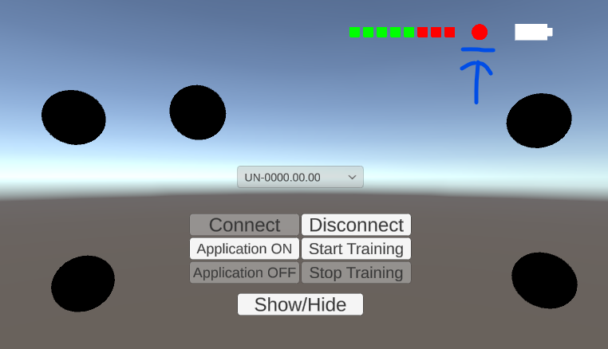

# How to play your custom BCI application?
In this session, we describe the rundown of a BCI game.

## Prequisite
- Unity ```2022.3.11.f1```
- Finished tutorial: [Build your first BCI application](/tutorial/build-your-first-bci-application.md)

## Connecting to the Unicorn
Start your BCI demo game.
<p align="center">
<br/>
</p>

1. On the upper right, we will find:
    - **8 Red boxs:** the EEG signal quality of each individual channels. In this case, we are using 8 channel Unicorn Hybrid black.
    - **Battery logo:** This show the battery level of your connected unicorn
    - **The white circle:** This indicates the classification accuracy after the training. Before training, it is white in color. 

2. Expand the dropdown to find the serial number of your Unicorn device:
    <p align="center">
    <br/>
    </p>

3. Select the serial number of your Unicorn and press **Connect**.
    <p align="center">
    <br/>
    </p>
    The BCI application shown here is connected with a Unicorn simulator. (serial number **UN-0000.00.00** is a simulator) This is created so that the developer can test the functionality of the BCI application without the device connected. Notice the change of the EEG signal displayed on the upper right corner. 

    (**Red**: Poor Signal Quality and **Green**: Good Signal Quality)

4. Press **Start Training** to start the training session.
    After the training session, you will obtain a classifier.
    <p align="center">
    <br/>
    </p>
5. Press **Application ON** to start interacting with your BCI application in realtime.

## Note
Congratualation for building your first ever BCI application. You are a BCI game developer now. Yet, debugging, mostly, is an unavoidable part of a successful BCI application. Please checkout the following tutorial about the best practice for developing your game: [Debugging your BCI game](/tutorial/DebuggingYourBCIGame.md)
