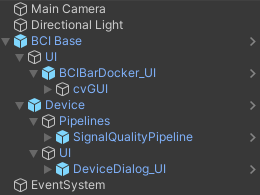
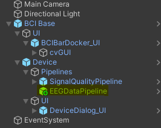
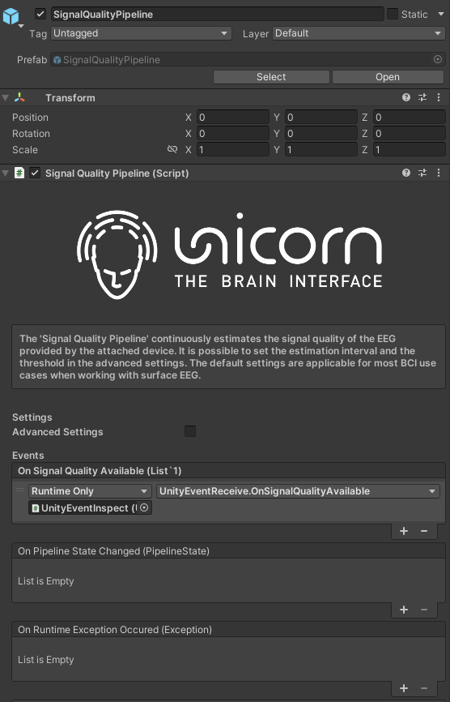
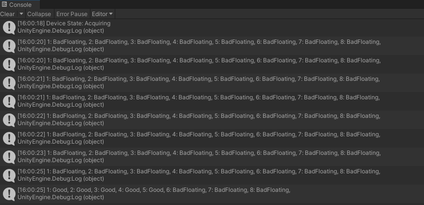
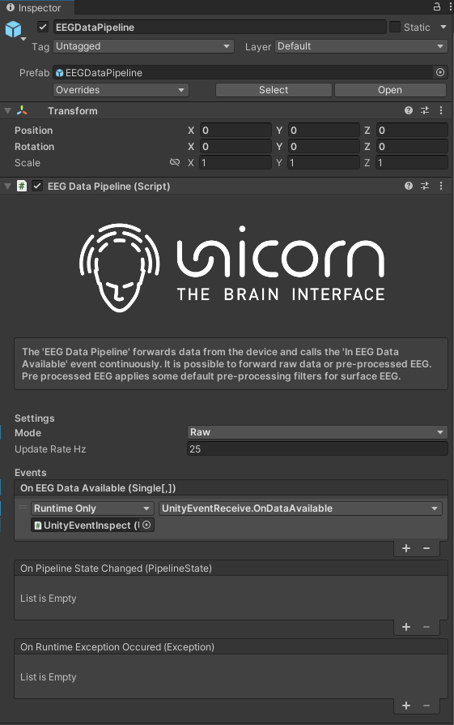
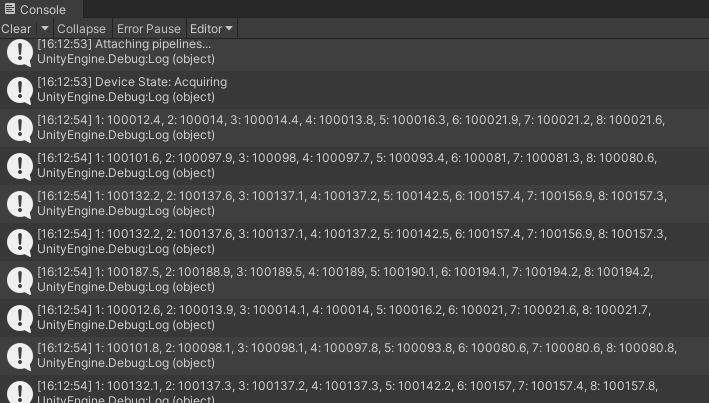

# Build a real-time EEG recorder
This tutorial demonstrates how to perform signal quality check, forward the raw data or pre-processed EEG from the Unicorn Hybrid Black device in realtime.

## Prequisite
- Unity ```2022.3.XX.XX```
- ```UnicornUnityInterface.unitypackage``` imported in the project.
- Finished tutorial: [Quick start guide](/tutorial/quick-start-guide.md)

## Create a New Scene
1. Create a new scene (`File`-> `New Scene`).
2. Save the scene as `MyFirstEEGRecorder.unity`.

## Add prefab "BCI Visual ERP 3D"
1. Navigate to `Assets/gtec/Unity Interface/Prefabs` and drag the prefab **BCI Base** to the scene.
2. Right click on the Hierarchy and add a UI gameobject **EventSystem** to the scene.

<p align="center">
<br/>
</p>

This **BCI Base** contains the feature of signal quality check in real time. The detailed description of the **BCI Base** prefab can be found in [Documentation](/tutorial/documentationComponent.md).

Next, we need to add the EEG recording functionality into our BCI system.

3. Navigate to ``Assets/gtec/Unity Interface/Prefabs/Pipelines/EEGData` and drag the prefab **EEGDataPipeline** inside the gameobject **Pipelines** in the scene hierarchy.
<p align="center">
<br/>
</p>

Congraduation! Your BCI setup is ready to use. Press the Play button to start your game scene. 
<p align="center">

</p>

## How to check your EEG signal quality in realtime?
On the upper left corner of your game scene, you should see a dropdown menu for device serial number.
<p align="center">

</p>

- `UN-0000.00.00` is a unicorn simulator. If you do not have a unicorn device with you, please select the simulator serial in the example. 
- Press the **Connect** button next to the dropdown menu to establish a bluetooth connection between your unity environment and the unicorn hybrid black device.    
    - Note: The **Connect** button will change into a **Disconnect**. you can press it to terminate the bluetooth connection with your unicorn hybrid black.
- After successfully establishing the connection, A bar with 8 elements will appear, each square element stands for the signal quality of one particular EEG channel in real-time (from left to right, channel 1 to channel 8 for unicorn hybrid black).
    <p align="center">
    
    </p>

    - Depending on the signal quality of a particular EEG channel, the corresponding square will either show light-blue or red color. A light-blue color means good signal quality and red color means bad quality. IT is recommended to have good EEG signal for all channels used in your unicorn device.

## Create your own custom behavior?

It is also possible to create your custom effect based on the EEG signal quality with the help of our unity event callback **On Signal Quality Available** and an external script. This callback can be found inside the **SignalQualityPipeline** gameobject.

1. Create a C# script called `UnityEventReceive.cs`.
2. Add the following function to your script. This script will print the signal quality of all channels in a string.
```Csharp
#region Signal Quality Pipeline Events
public void OnSignalQualityAvailable(List<ChannelStates> channelStates)
{
    string channelStatesString = string.Empty;
    for (int i = 0; i < channelStates.Count; i++)
        channelStatesString += string.Format("{0}: {1}, ", i + 1, channelStates[i].ToString());
    Debug.Log(channelStatesString);
}
#endregion
```
3. Create a game object call **UnityEventInspect** and add the `UnityEventReceive.cs` to this gameobject. 


4. Attach your gameobject **UnityEventInspect** and the function `OnSignalQualityAvailable()` to the event callback **On Signal Quality Available**

<p align="center">
    
</p>

Start your scene, connect to the unicorn simulator and inspect the Console log. You will be able to see the signal quality data in real-time.
<p align="center">
    
</p>

## How to forward the data from the device to unity in realtime?
It is possible to forwards the raw data or pre-processed EEG from the device to unity with the help of our unity event callback **On EEG Data Available** and an external script. This callback can be found inside the **EEGDataPIpeline** gameobject. 

Following a similiar approach as described in [Create your ownd custom behavior](#create-your-own-custom-behavior), add a new function to the `UnityEventReceive.cs`.
```Csharp
public void OnDataAvailable(float[,] e)
{
    string channelDataString = string.Empty;
    for (int i = 0; i < e.GetLength(1); i++)
        channelDataString += string.Format("{0}: {1}, ", i + 1, e[0, i].ToString());
    Debug.Log(channelDataString);
}
```

Attach your gameobject **UnityEventInspect** and the function `OnDataAvailable()` to the event callback **On EEG Data Available**.
<p align="center">
    
</p>

Remove your gameobject attach to event **On Signal Quality Available**, and start your scene again, connect to the unicorn simulator and inspect the Console log. You will be able to see the EEG data value in realtime.
<p align="center">
    
</p>

Note: The frequency of calling the events **On EEG Data Available** and **On Signal Quality Available** are different.


## Short summary
After this tutorial, you should be able to perform signal quality check and acquire the EEG data from the unicorn device. Congraduation!

## Next Step
- [Build you first BCI application](/tutorial/build-your-first-bci-application.md)
