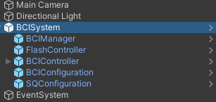
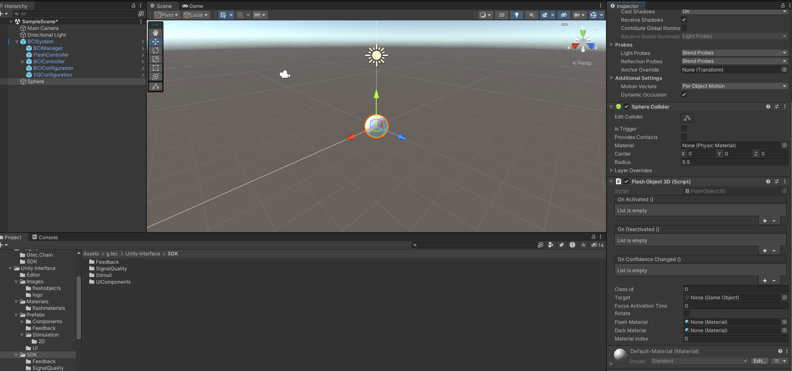
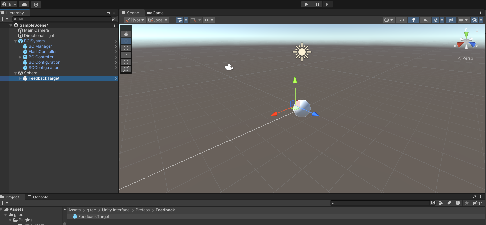
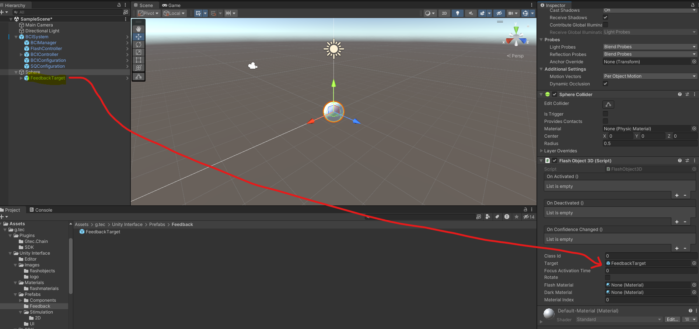
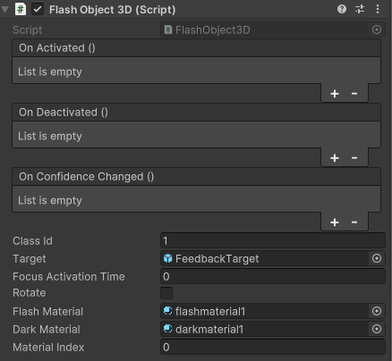
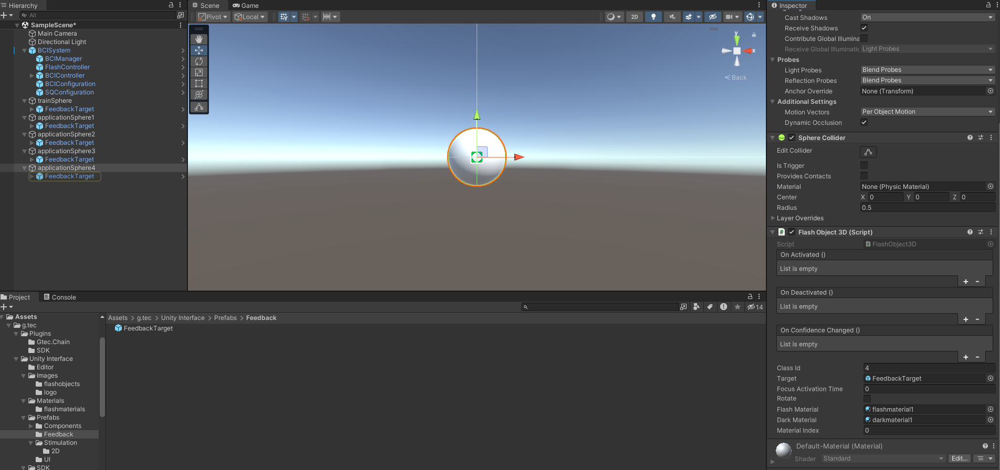
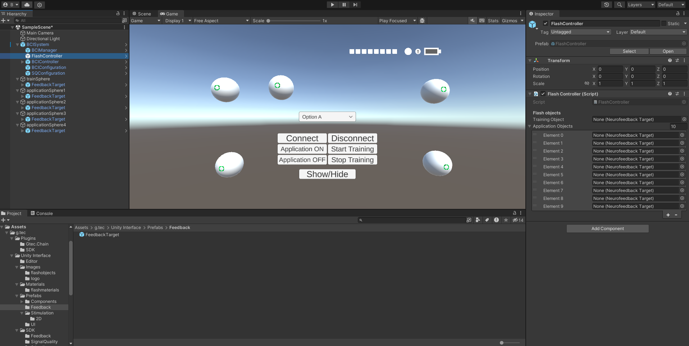
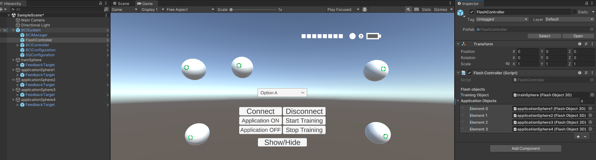
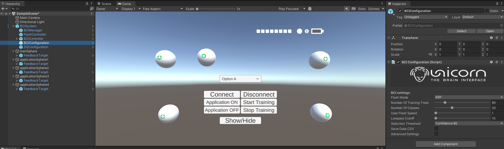
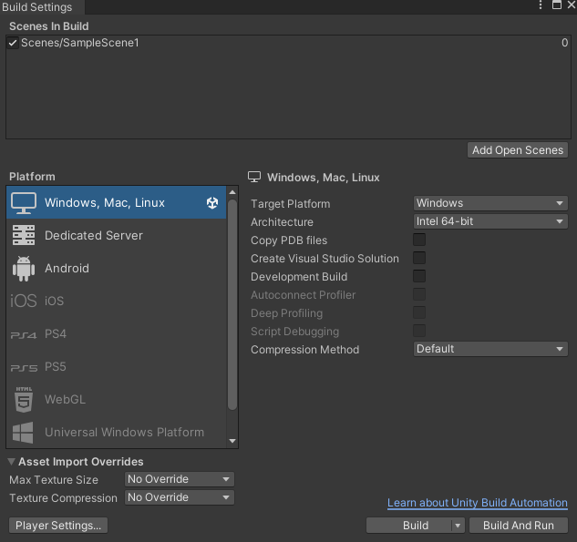

# Build your first BCI application
Follow these steps to build your first BCI application.

## Prequisite
- Unity ```2022.3.XX.XX```
- ```UnicornUnityInterface.unitypackage``` imported in the project.
- Finished tutorial: [Quick start guide](/tutorial/quick-start-guide.md)

## Step 1: Create a New Scene
1. Create a new scene (`File`-> `New Scene`).
2. Save the scene as `MyFirstBCIApp.unity`.

## Step 2: Add prefab "BCI Visual ERP 3D"

## Add BCISystem to the scene
1. Navigate to ```Assets/g.tec/Unity Interface/Prefabs``` and drag the prefab **BCIsystem** to the **SampleScene**. 
2. Right click on the Hierarchy and add a UI gameobject **EventSystem**.

<p align="center">
<br/>
</p>

The BCISystem is the core component of our BCI application. It creates a communication between the unity scenario and the Unicorn Hybrid black. 
 consists 5 sub-prefabs. As a standing point to use our unitypackage, it is recommended to use the pre-defined prefab in the beginning to familiar with the system. 

The UnicornUnity package is constructed in an Event-callback design. There are 5
distinct childobjects inside the **BCISystem** object. For detailed documentation, please refer to:
 [Documentations](/tutorial/documentationComponent.md)

 ## Create a new 3D/2D sphere gameobject for training in the scenario.
 1. If you created a 3D sphere, add a component called **FlashObject 3D** to the gameobject and vice versa for 2D.
 <p align="center">
<br/>
</p>

2. Nevigate to the ``Assets/g.tec/Unity Interface/Pregfabs/Feedback`` in the Project explorer, and drag the DeedbackTarget prefab inside the Sphere gameobject.
 <p align="center">
<br/>
</p>

3. In the Sphere gameobject's **FlashhObject3D** component:
    - Set **Class Id**: 1
    - Drag your **FeedbackTarget** gameobject in the scene to **Target**
     <p align="center">
    <br/>
    </p>
    - Select `flashmaterial1.mat` for **Flash Material**
    - Select `darkmaterial1.mat`for **Dark Material**
    When you finish the setup, it should look like:
     <p align="center">
    <br/>
    </p>
    - Rename your sphere gameobject as trainingSphere.

    **Note**: 

    The following settings are for demonstration purpose. Please refers to [Documentation](/tutorial/documentationComponent.md) for a detailed description about the configuration.
    
## Create some Application Objects in the scenario
In this example, we will create 4 application objects as a demo.

1. First, select the trainSphere in your scenario and press ``Crtl + D`` 4 times. You should be able to see 4 duplicated instance of the training objects.
<p align="center">
    <br/>
</p>

2. Rename them to **applicationSphere1**, **applicationSphere2**, **applicationSphere3**, **applicationSphere4**.

3. For each FlashObject3D component inside the applicationSphere, please update the classId according to the order. (ie. **Class id** = 2 for **applicationSphere2**)

4. Make sure that the Target **FeedbackTarget** defined in FlashObject3D script for each applicationSphere refers to their corresponding child object. For example, if you click on the **FeedbackTarget** for applicationSphere4, it should refer to the **FeedbackTarget** in **applicationSphere4**.
    <p align="center">
        <br/>
    </p>

    If this is not the case, please update them manually. 

5. Re-arrange the location of each object in the scenario for better visualization. Here is an example:
    <p align="center">
    <br/>
    </p>


So now, we have the basic components inside the scenario, `1 training object`, `4 application objects` and the `BCISystem`. It is time to create connections between our objects to the **BCISystem**.

## How to link Gameobjects to the BCISystem?
Inside the gameobject **BCISystem**, there are 5 different child objects. For a detailed description, please refers to [Documentation](/tutorial/documentationComponent.md). For now, we will focus on **FlashController** and **BCIConfiguration**.

### FlashController
<p align="center">
<br/>
</p>

By default, there are 10 application objects defined in the **FlashController**. In this demo, please set the number of application objects to 4 and 
- Drag the **trainingSphere** to **Training Object** inside the **FlashController**.
- Drag **applicationShpere1**, **applicationShpere2**, **applicationShpere3**, **applicationShpere4** to **Application Objects** inside the **FlashController**.

The order of **Application Objects** is not important. However, for the sake of easy debugging, please place them accordingly to the index in this demo example. In the end, you should get:
<p align="center">
<br/>
</p>

### BCIConfiguration
<p align="center">
<br/>
</p>

**BCIConfiguration** plays an important role in our SDK. (refers to [Documentation](/tutorial/documentationComponent.md) for more information) For now, Change the **Number of Classes** to 4. 

**Note**:
- If you would like to test cVEP, please change the **Flash Mode** to `CVEP`.
- You can reduce the time needed for training session by:
    1. Reducing the **Number of Training Trials**
    2. Increate the **User Flash Speed**
- You can change the confidence interval by changing the **Selection Threshold**.

Congratualation! You have completed the setup of your initial BCI application.

## Build your first game
Save your scenario with a name.

On the upper toolbar, select `File`-> `Build Settings`.
<p align="center">
<br/>
</p>

Add your scenario to the **Scene in Build**. Now, you can click **Build** on the botton right to build your game executable for later testing, or click **Build and Run** to start playing with the game.

# What to do next?
Check out the next tutorial: [How to play your custom BCI application?](/tutorial/BCIGameRuntime.md)
