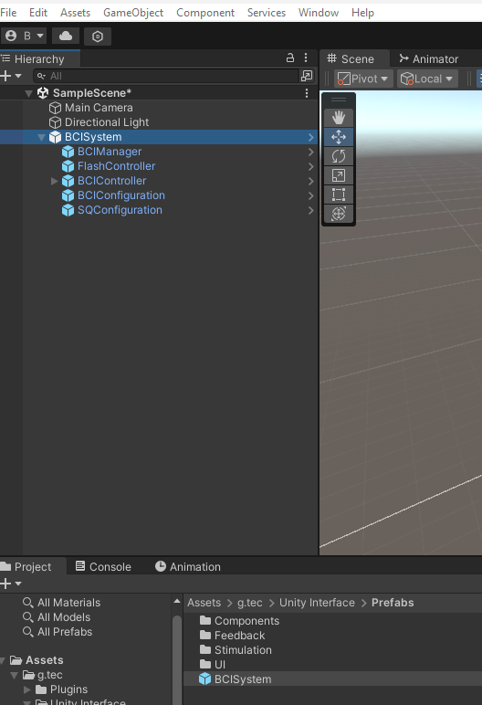

# Build your first BCI application

## Prequisite
- Unity ```2022.3.11.f1```
- ```UnicornUnityInterface.unitypackage``` imported in the project.

## Add BCISystem to the scene
Navigate to ```Assets/g.tec/Unity Interface/Prefabs``` and drag the prefab **BCIsystem** to the **SampleScene**.

<p align="center">
<br/>
</p>

The BCISystem is the core component of our BCI application. It creates a communication between the unity scenario and the Unicorn Hybrid black. 
 consists 5 sub-prefabs. As a standing point to use our unitypackage, it is recommended to use the pre-defined prefab in the beginning to familiar with the system. 

The UnicornUnity package is constructed in an Event-callback design. There are 5
distinct childobjects inside the ``BCISystem`` object. For detailed documentation, please refer to:
 [Documentations](/tutorial/documentationComponent.md)