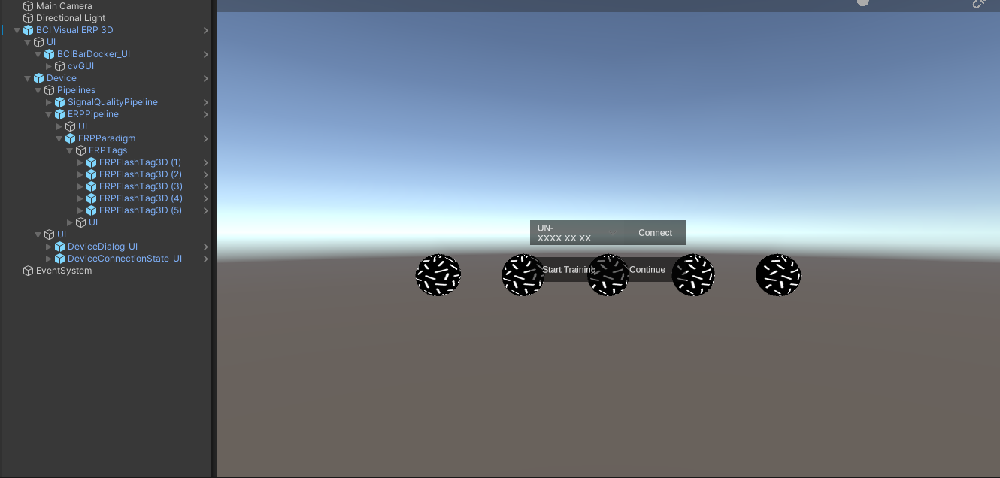
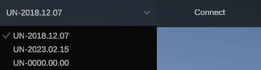

# Build your first ERP-based BCI game in Unity

## Prequisite
- Unity ```2022.3.XX.XX```
- ```UnicornUnityInterface.unitypackage``` imported in the project.
- Completed tutorials:
    - [Quick start guide](/tutorial/quick-start-guide.md)
    - [Build your first realtime EEG recorder in Unity](/tutorial/Build-your-first-real-time-EEG-recorder-in-Unity.md)

## Create a New Scene
1. Create a new scene (`File`-> `New Scene`).
2. Save the scene as `MyFirstERPBCI.unity`.

## Add prefab "BCI Visual ERP 3D"
1. Navigate to `Assets/gtec/Unity Interface/Prefabs` and drag the prefab **BCI Visual ERP 3D** to the scene.
2. Right click on the Hierarchy and add a UI gameobject **EventSystem** to the scene.

<p align="center">
<br/>
</p>

The **BCI Visual ERP 3D** contains:
- A **Signal Quality Pipeline**
- A **ERPPipeline** for processes event-related potentials (ERPs)
- 5 **ERPFlashTag3D** gameobjects for BCI selection

The detailed description cane be found in [Documentation](/tutorial/documentationComponent.md).

Congraduation! Your BCI setup is ready to use. Press the Play button to start your game scene.
<p align="center">

</p>

## Runtime description
On the upper left corner of your game scene, you should see a dropdown menu for device serial number.
<p align="center">

</p>

- `UN-0000.00.00` is a unicorn simulator. If you do not have a unicorn device with you, please select the simulator serial in the example. 

- Press the **Connect** button next to the dropdown menu to establish a bluetooth connection between your unity environment and the unicorn hybrid black device.
    <p align="center">
    
    </p>

    1. The **Connect** button will change into a **Disconnect**. You can press it to terminate the bluetooth connection with your unicorn hybrid black.
    2. If you have established a connection with a unicorn simulator or a unicorn hybrid black device, you will see 8 EEG signal quality checkerboxes. Each box stands for the signal quality of one particular EEG channel in real-time (from left to right, channel 1 to channel 8 for unicorn hybrid black). 
    3. When all boxes are light-blue in color, press **Start Training** to enter the calibration /training phase.


- The **Start training** button will change to **Stop training**. You have the option to stop the training session at anytime. But, it is required to have at least 30 seconds of training (i.e. 30 trials). 60 trials is recommended for most applications.
    <p align="center">
    
    </p>

- After the **training** session, you should see the following changes in the UI bar.
    <p align="center">
    
    </p>

    1. On the left side, the colored circle UI indicates the classifier performance of your training session.
        - Red: Very bad performance. It is recommended to re-do the training.
        - Yellow: Ok performance. The classifier will work in your game with slower response. It is also recommended to re-do the training. 
        - Green: Good performance. Your classifier is perfect. You may move on the your actual game.
    2. You can either:
        - Press **Continue** to the BCI appication.
        - Press **Retrain** to re-do the training session and obtain a better classifier.
        - Press **Disconnect** to terminate the connection with the unicorn device and end your game.

- When you pressed the **Continue** button, the classifier will start outputing BCI command based on your ERP. At anytime, you can retrain your classifier or terminate the connection with the unicorn device.
    <p align="center">
    
    </p>

## Advance: Unity Event Callbacks
It is possible for developers to create a custom effect based on calibration result, and the class selection during the game.

### Create your own custom behavior for classifier performance?
It is possible to create your custom effect based on the classifier performance with the help of our unity event callback **On Calibration Result** and an external script. This callback can be found inside the **ERPPipeline** gameobject.
1. Create a C# script called UnityEventReceive.cs.
2. Add the following function to your script. This script will print the signal quality of all channels in a string.
    ```Csharp
        public void OnCalibrationResult(ERPPipeline erpPipeline, CalibrationResult result)
        {
            Debug.Log("CalibrationResult: " + result.CalibrationQuality.ToString());
        }
    ```
3. Create a game object call UnityEventInspect and add the UnityEventReceive.cs to this gameobject.

4. Attach your gameobject UnityEventInspect and the function `OnCalibrationResult()` to the event callback **On Calibration Result**

#### To do Add image

### Create your own custom bahavior for class selection?
It is possible to create your custom effect based on the classifier performance with the help of our unity event callback **On Class Selection** and an external script. This callback can be found inside the **ERPPipeline** gameobject.
1. Add the following function to your script. This script will print the signal quality of all channels in a string.
    ```Csharp
        public void OnClassificationSelection(ERPPipeline erpPipeline, ClassSelection classSelection)
        {
            Debug.Log("ClassSelection: " + classSelection.Class.ToString());
        }
    ```
3. Create a game object call UnityEventInspect and add the UnityEventReceive.cs to this gameobject.
4. Attach your gameobject UnityEventInspect and the function `OnClassificationSelection()` to the event callback **On Class Selection**

#### To do Add image

## Short summary
After this tutorial, you should be able to run a simple BCI application with the unicorn hybrid black. Congraduation!

`Note`: This section aims to showcase the basic of developing a BCI application. Please refer to [Documentation](/tutorial/documentationComponent.md) for a detail description for individual components inside the **BCI Visual ERP 3D**.
