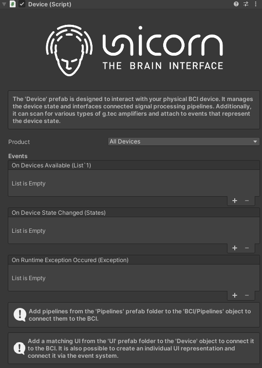

# Device.prefab
> Prefab Reference Location: `Assets\gtec\Unity Interface\Prefabs\Device`

## Overview
The `Device` prefab is designed to interact with the Unicorn Hybrid Black. It manages the device state and interfaces connected to signal processing pipelines. Additionally, it can scan for various types of g.tec amplifiers and attach to events that represent the device state. It contains a `Device.cs` script.

<p align="center">
<br/>
</p>

## Event callbacks and functions

### On Device Available
- Description: The event called when devices are discovered.
- Return: List of available devices with type `List<string>`

### On Device State Changed
- Description: The event called when device state changed.
- Return: A device state with type 'States'

```CSharp
public enum States
    {
        Disconnected,
        Connecting,
        Connected,
        Acquiring
    }
```

### On Runtime Exception Occured
- Description: The event called when a runtime exception occured.
- Return: A `System.Exception` message

## Additional details and tips
- Two all-in-one prefab `BCI Visual ERP 3D` and `BCI Base` have been created for developers to avoid manually connecting events across different prefabs. It is recommended to use these prefabs for starting your BCI game.

## Back to:
[Documentation/Prefab Description](/tutorial/Documentation.md/#prefab-descriptions)