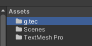
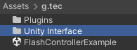
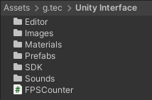

# Documentation
This gives a detailed introduction of the UnicornUnity package.

### Prerequisites
- UnicornUnityInterface unity package

### Folder path:
1. Nevigate to folder ``g.tec`` inside the `Assets`.

 

2. Go to the folder `Unity Interface` inside `g.tec`. This is the core folder of the whole UnicornUnity package.

 

### Detail description:
- [Images](/tutorial/Images.md)