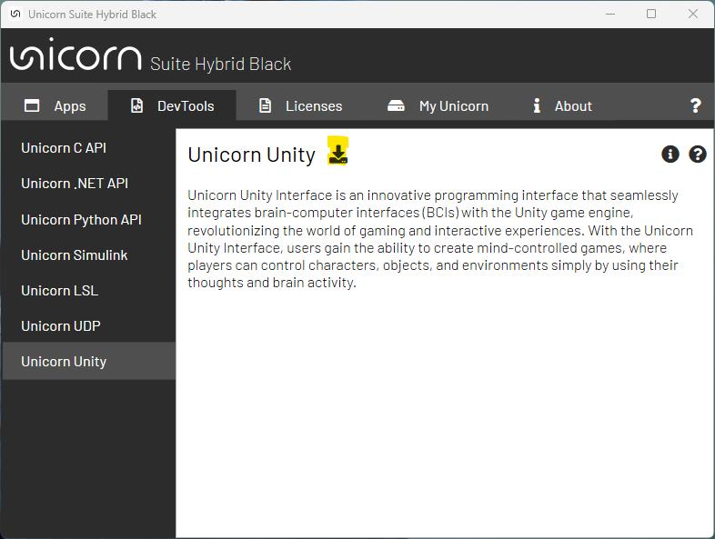

## Installation guideline
1. Start the software **Unicorn Suite Hybrid Black**, nevigate to the **DevTools** on the upper menu bar and select **Unicorn Unity**. You should see the following window:
<p align="center">
<br/>
</p>

2. Proceed to download your Unicorn Unity package by pressing the button highlighted with yellow color in the above screenshot. 

3. When the download is finished, press . 

4. Click the Open button, and you will find the latest version of our UnicornUnityInterface.<br/><br/>

The path is:

```
C:\Users\<username>\Documents\gtec\Unicorn Suite\Hybrid Black\Unicorn Unity Interface
```

You are ready go to!

Proceed to [Setting Up the Environment](/tutorial/setting-up-the-environment.md) to configure your unity for the first BCI game.
