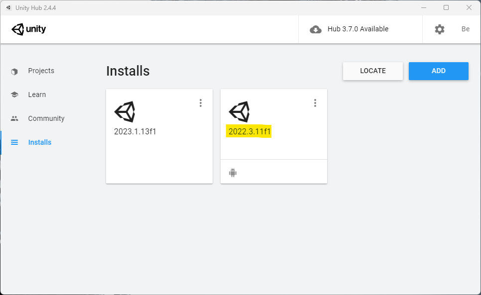
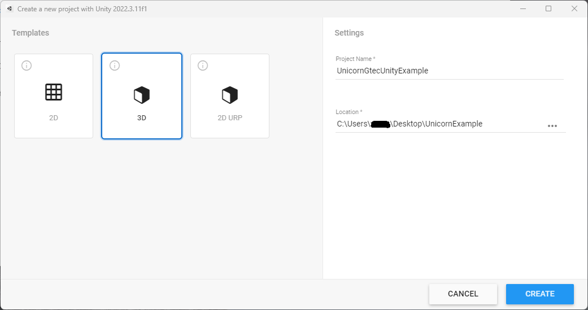
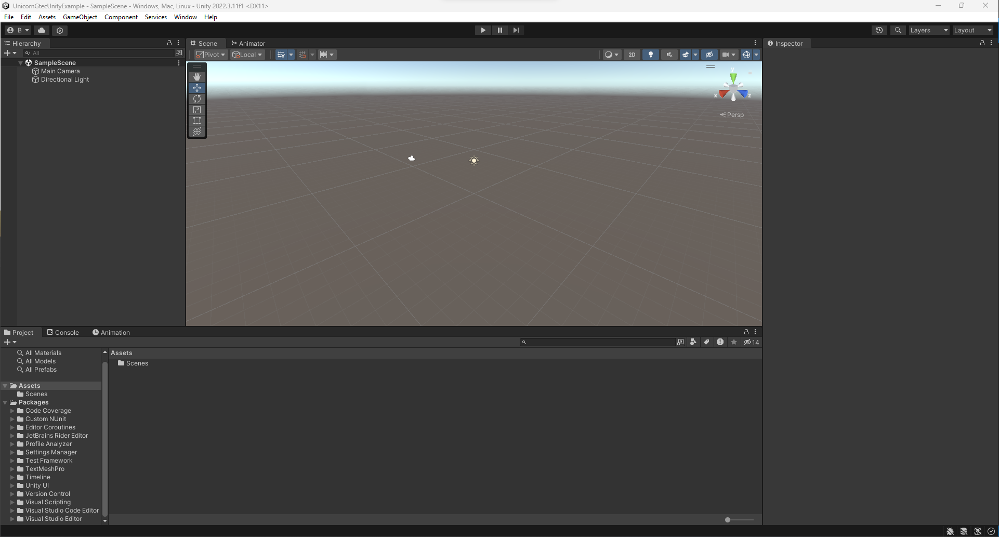
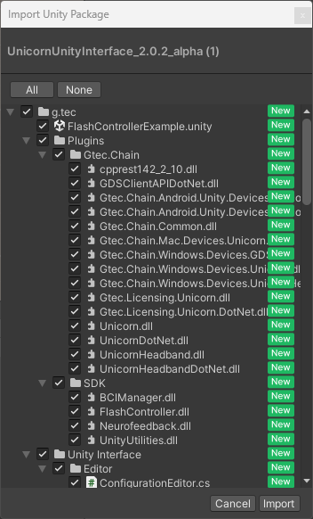

## Setting up the Environment
### Prerequisites
- UnicornUnityInterface unity package

### Install Unity Editor
Install Unity with unity hub, click **Installs**:
<p align="center">
<br/>
</p>

**Attention**: <br/>
We recommend using Unity ```2022.3.11f1```. 

### Create a new unity project
1. In unity hub, select **Projects** and click <br/>
2. Select the dropdown button next to **NEW**. You should be able to view all installed unity versions. Select ```2022.3.11.f1```
3. Keep the **default 3D template** for this project, **name** your project and specify the **project location**. Click on **Create**.

Here is a screenshot of the configuration:
<p align="center">
<br/>
</p>

The default unity environment is shown as below:
<p align="center">
<br/>
</p>

### Import Unicorn Unity Interface unity package
Navigate to the "**Assets**" in the toolbar menu. Select "**Import Package**" → "**Custom Package**"

A window called Import Unity Package should pop up. Go to the following path:
```
C:\Users\<username>\Documents\gtec\Unicorn Suite\Hybrid Black\Unicorn Unity Interface
```
And search for the UnicornUnityInterface.unitypackage inside the file explorer.
Import the package and wait for the process to complete.
<p align="center">
<br/>
</p>

Your unity environment is ready for a BCI game now. 

Check out the next tutorial: [Build you first BCI application](/tutorial/build-your-first-bci-application.md)
